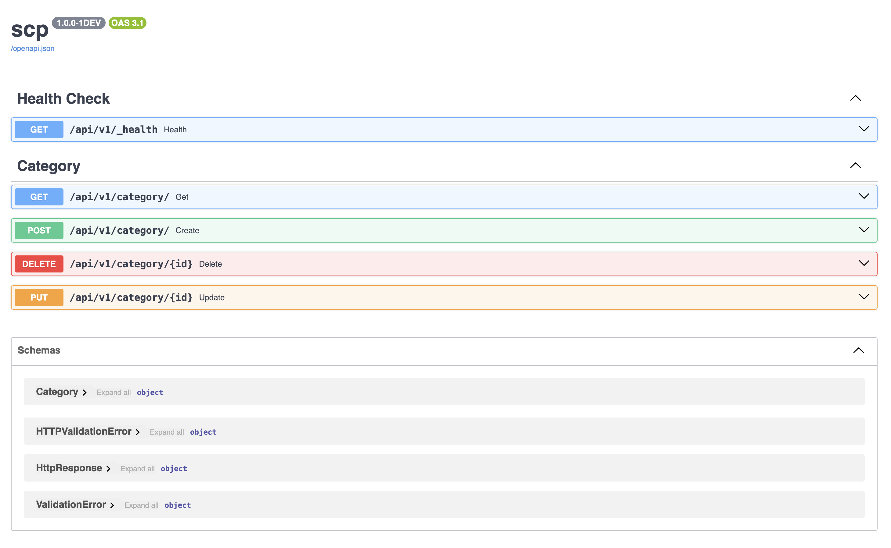

# SCP-LIB  | SECURE, CONTAIN, PROTECT LIBRARY `WIP`


> Just fun project for yet another SCP Library

## Screenshoot


## How to run
```
devbox shell
npm install
devbox services start postgresql
devbox run initdb
devbox run createuser --interactive
```

## TODO's

* [ ] Finish all backend
* [ ] Create homepage and all mvp page